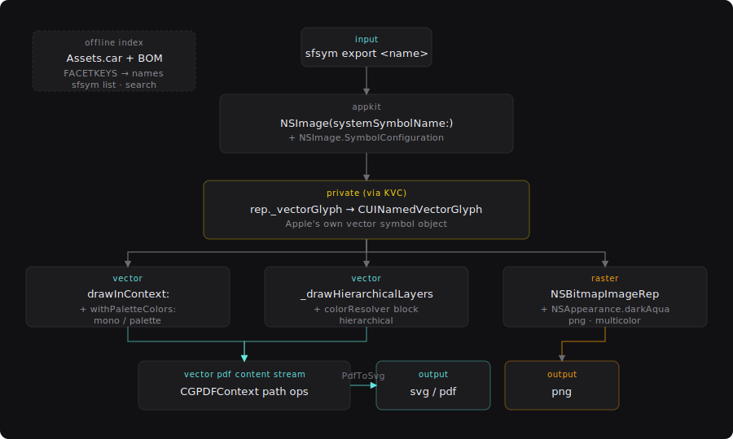

# sfsym



[](https://github.com/yapstudios/homebrew-tap)
[](./LICENSE)

A command-line tool for exporting Apple SF Symbols as SVG, PDF, or PNG. The vector paths come directly from macOS's symbol renderer, so the output is the same geometry the system draws. No Xcode project, no redraw, and no runtime dependency on SF Symbols.app.

```sh
sfsym export heart.fill -f svg -o heart.svg
# 569B -> heart.svg
```

> **Before you use this**
>
> - **Licensing.** SF Symbols are Apple property. The [SF Symbols License](https://developer.apple.com/support/terms/) permits their use only in artwork and mockups for apps that run on Apple platforms. `sfsym` is a tool; the restriction applies to what you ship with the output it produces. Don't embed SF Symbols in an Android app or a generic website.
> - **Private API.** The renderer reads a private ivar on `NSSymbolImageRep` to reach the underlying `CUINamedVectorGlyph` object. This has been stable from macOS 13 through macOS 26, but Apple doesn't guarantee it. If a future release changes the layout, `sfsym` fails fast rather than producing incorrect output.

## Install

### Homebrew

```sh
brew install yapstudios/tap/sfsym
```

A prebuilt universal binary. No compile step, no Xcode dependency. Runs on macOS 13 (Ventura) or later, on Apple silicon or Intel.

### From source

Requires Xcode Command Line Tools (`xcode-select --install`).

```sh
git clone https://github.com/yapstudios/sfsym.git
cd sfsym
Scripts/install.sh
```

The script builds a release binary and installs it at `~/.local/bin/sfsym`.

### Manual

```sh
swift build -c release
cp -f .build/release/sfsym ~/.local/bin/sfsym
```

## Quick start

```sh
# Format is inferred from the -o extension.
sfsym export heart.fill -o heart.svg

# Colored and sized.
sfsym export star.fill --color '#FFD60A' --size 48 -o star.svg

# Short hex and alpha are both accepted.
sfsym export heart.fill --color '#f00' -o heart.svg
sfsym export heart.fill --color '#007AFF80' -o half.svg    # fill-opacity preserved

# Multi-layer symbol with per-layer colors.
sfsym export cloud.sun.rain.fill \
  --mode palette --palette '#4477ff,#ffcc00,#ff3b30' -o weather.svg

# Vector PDF with Apple's hierarchical opacity ladder.
sfsym export heart.fill -f pdf --mode hierarchical --color '#007AFF' -o heart.pdf

# PNG at 2x pixel density: --size 128 produces 256x256 pixels.
sfsym export cloud.sun.rain.fill -f png --mode multicolor --size 128 -o cloud@2x.png

# Find a symbol by keyword or category, then export it.
sfsym list --search magnifyingglass
sfsym list --category weather --limit 10
```

## Commands

### `export`

Renders a single symbol. The output format is inferred from the `-o` file extension (`.svg`, `.pdf`, or `.png`); use `-f` to override. The default format is SVG.

```sh
sfsym export <name>  [-f pdf|png|svg]
                     [--mode monochrome|hierarchical|palette|multicolor]
                     [--weight ultralight|thin|light|regular|medium|semibold|bold|heavy|black]
                     [--scale small|medium|large]
                     [--size <int 1..2048>]
                     [--color <hex|systemName>]
                     [--palette <hex,hex,...>]
                     [-o <path>|-]
                     [--json]
```

Colors accept `#RGB`, `#RGBA`, `#RRGGBB`, `#RRGGBBAA`, or an Apple system color name such as `systemRed`, `systemBlue`, `label`, or `systemGray2`. Run `sfsym colors` for the full list. SVG output preserves alpha as `fill-opacity`.

`--size N` produces a square `N × N`-point canvas in every format. The symbol is scaled uniformly to fit and is centered inside the canvas. PNG output uses 2x pixel density, so `--size 128` becomes a `256 × 256`-pixel file.

In `palette` mode, colors cycle if there are fewer than the symbol has layers, and `sfsym` prints a warning if there are more. Passing `--color` in a mode that ignores it, or `--palette` in a mode that ignores it, prints a one-line warning to stderr.

Passing `--json` with a file path writes the image as usual and prints a JSON summary (`{"name", "format", "path", "bytes"}`) to stdout. Passing `--json` with `-o -` sends the image bytes to stdout and the summary to stderr.

### `batch`

Reads one `export` invocation per line from stdin. Because Swift and AppKit start once, throughput reaches about 800 exports per second. Lines may optionally begin with `export` or `sfsym export`.

```sh
printf 'heart.fill -f svg -o heart.svg\n\
star.fill  -f svg -o star.svg\n' | sfsym batch
# batch: ok=2 fail=0 in 0.01s (284/s)
```

Exporting the entire library:

```sh
sfsym list | awk '{print $1 " -f svg -o out/"$1".svg"}' | sfsym batch
# batch: ok=8302 fail=1 in 10.1s (822/s)
```

The exit code is `2` if any line fails and `0` otherwise. `--fail-fast` stops after the first failure. With `--json`, each failure is written as a JSON object on stderr (`{"code", "error", "line"}`), and the run ends with a final summary object (`{"code": "summary", "ok", "fail", "seconds", "rate"}`). The entire stream is parseable by `jq`.

### `list`

Enumerates every SF Symbol name the OS knows about (8,300 or more). The data is read directly from the installed `Assets.car`, so the list stays current with OS updates without a version table baked into the binary.

```sh
sfsym list                              # every name, newline-separated
sfsym list --prefix cloud               # filter by name prefix
sfsym list --contains check             # case-insensitive substring match
sfsym list --category weather           # filter by Apple's taxonomy
sfsym list --search magnifyingglass     # filter by Apple's semantic keywords
sfsym list --limit 20                   # cap the result count
sfsym list --json                       # emit a JSON array
```

`--category` and `--search` read metadata from `/Applications/SF Symbols.app/Contents/Resources/Metadata/`. If SF Symbols.app isn't installed, those two flags return an error; the others work without it.

### `info`

Prints geometry and layer metadata for a single symbol.

```sh
sfsym info heart.fill --json
```

```json
{
  "name": "heart.fill",
  "size": { "width": 40, "height": 33 },
  "alignmentRect": { "x": 4, "y": 2, "width": 31.5, "height": 29 },
  "templateLayers": 1,
  "hierarchyLayers": 1,
  "paletteLayers": 1,
  "hierarchyLevels": [0],
  "modes": ["monochrome", "hierarchical", "palette"]
}
```

### `modes`

Lists the rendering modes available for a symbol.

```sh
sfsym modes cloud.sun.rain.fill --json
# ["monochrome","hierarchical","palette","multicolor"]
```

### `colors`

Lists every named color that `--color` and `--palette` accept, with its resolved sRGB hex value.

```sh
sfsym colors --json
# [{"name":"systemRed","hex":"#ff383c"}, ...]
```

### `categories`

Lists Apple's category keys (`communication`, `weather`, `devices`, and so on). Use this alongside `list --category`. The data is sourced from SF Symbols.app; if the app isn't installed, the command exits with code 1 and an empty result.

```sh
sfsym categories --json
```

### `schema`

Prints a machine-readable description of the CLI as JSON: every subcommand, flag, enum, default, and a set of example invocations. Intended for LLM tools and scripted automation.

```sh
sfsym schema | jq '.commands[] | .name'
```

## Rendering modes

| Mode | Output | Behavior |
|------|--------|----------|
| `monochrome` | vector | Every layer is filled with the `--color` tint. |
| `hierarchical` | vector | Primary, secondary, and tertiary tiers at Apple's `1.0 / 0.68 / 0.32` opacity ladder of `--color`. |
| `palette` | vector | One `--palette` color per layer, in Apple's declared layer order. |
| `multicolor` | raster in PDF; vector in PNG only through `-f png` | Apple's baked-in per-layer tints. |

The matrix is format-sensitive:

| Format | monochrome | hierarchical | palette | multicolor |
|--------|:----------:|:------------:|:-------:|:----------:|
| **SVG** | vector | vector | vector | -- |
| **PDF** | vector | vector | vector | raster in PDF |
| **PNG** | raster | raster | raster | raster |

SVG multicolor isn't supported. The private vector entry point inside CoreUI crashes when the color-resolver block runs outside of SF Symbols.app's process. For multicolor output, use `-f png`. For vector output with per-layer colors, use `palette` mode.

## Shell completions

`sfsym` ships completion scripts for bash, zsh, and fish. Symbol-name completion is generated at tab time by invoking `sfsym list`, so symbols added by a macOS update are picked up immediately, without regenerating the script.

```sh
# Zsh
sfsym completions zsh > ~/.zsh/completions/_sfsym
# then in ~/.zshrc:
fpath=(~/.zsh/completions $fpath)
autoload -U compinit && compinit

# Bash
sfsym completions bash > /usr/local/etc/bash_completion.d/sfsym
# or source it inline:
source <(sfsym completions bash)

# Fish
sfsym completions fish > ~/.config/fish/completions/sfsym.fish
```

## How it works



### Rendering pipeline

1. `NSImage(systemSymbolName:)` with an `NSImage.SymbolConfiguration` produces an `NSSymbolImageRep`.
2. The rep's private `_vectorGlyph` ivar is a `CUINamedVectorGlyph`, Apple's runtime symbol object. It exposes per-layer `CGPath` access and a small set of draw entry points.
3. For vector output, `sfsym` draws the glyph into a `CGPDFContext`. The resulting PDF content stream consists of path operators (`m`, `l`, `c`, `re`, `f`) with no embedded images.
4. For SVG, a small PDF interpreter walks those operators, rewrites them as SVG `d` attribute commands, flips the Y axis, and tags each `<path>` with its Apple layer index (for example, `data-layer="hierarchical-0"` or `palette-3`). Downstream tools can restyle the output without touching the geometry.
5. For PNG, `NSBitmapImageRep` renders at 2x pixel density under `NSAppearance(named: .aqua)` so that multicolor system tints resolve predictably. (Using `.darkAqua` silently mirrors several symbol families — the `tophalf`/`bottomhalf`/`lefthalf`/`righthalf` variants — so the filled half lands on the wrong side of the glyph.)

### Symbol enumeration

`sfsym list` walks the BOM tree inside `CoreGlyphs.bundle/Contents/Resources/Assets.car` and extracts every `FACETKEYS` entry that has an identifier attribute. This is the same file AppKit reads from, so the two enumerations never disagree.

## Output conventions

- **SVG.** Self-contained, with no external CSS. The `viewBox` is `0 0 size size`, a square canvas with the symbol scaled to fit and centered. A single `<svg>` root contains a Y-flip group that wraps Apple's paths. Every `<path>` carries a `fill` attribute (sRGB hex), a `data-layer` attribute (`monochrome-0`, `hierarchical-N`, or `palette-N`), and `fill-opacity` when alpha is less than 1 or when drawing a hierarchical tier. The geometry matches Apple's PDF output exactly.
- **PDF.** Single page, with a `MediaBox` of `size × size` points. Vector for monochrome, hierarchical, and palette modes. Multicolor output embeds a rasterized image.
- **PNG.** Square output at `2·size × 2·size` pixels (2x pixel density). Rendered under `aqua` so that dynamic colors resolve and half-filled symbols keep their canonical orientation.

## Comparison

| | sfsym | SF Symbols.app "Copy as SVG" | `Image(systemName:)` | Manual export |
|---|:---:|:---:|:---:|:---:|
| Works from the command line | Yes | No | No | Varies |
| Scriptable | Yes | No | No | No |
| Covers all 8,300+ symbols | Yes | Yes | Yes | Yes |
| Vector SVG | Yes | Yes | n/a | Yes |
| Per-mode output | Yes | No (monochrome template only) | No | No |
| Per-layer data attributes | Yes | No | No | No |
| Stays current with OS updates | Yes (reads installed bundle) | Yes | Yes | No |
| AI-agent-compatible | Yes (`schema`, `--json`, stable exit codes) | No | No | No |

## Project structure

```
sfsym/
├── Sources/sfsym/
│   ├── main.swift                   # entry point, error-to-exit-code mapping
│   ├── CLI.swift                    # argument parsing, usage text, schema
│   ├── Render.swift                 # PDF, PNG, and SVG orchestration
│   ├── Glyph.swift                  # CUINamedVectorGlyph KVC wrapper
│   ├── PdfToSvg.swift               # PDF content-stream interpreter and SVG emitter
│   ├── AssetsCar.swift              # BOMStore reader for FACETKEYS
│   ├── Catalog.swift                # name enumeration for sfsym list
│   ├── Metadata.swift               # categories and search data from SF Symbols.app
│   └── Completions.swift            # bash, zsh, and fish completion scripts
├── Sources/harness/
│   └── main.swift                   # diff harness (48 symbols, modes, formats)
├── Scripts/
│   └── install.sh                   # build and copy to ~/.local/bin
├── Package.swift
└── demo.svg                         # header animation
```

## License

MIT. See [LICENSE](./LICENSE).

Output produced by `sfsym` contains symbols that are property of Apple Inc. Use of SF Symbols is governed by the [SF Symbols License](https://developer.apple.com/support/terms/), which permits their use only in artwork and mockups for apps developed for Apple platforms.

This project isn't affiliated with Apple Inc. SF Symbols and related marks are trademarks of Apple Inc.
